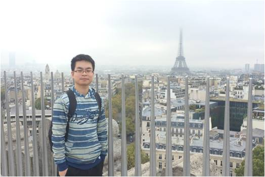

<!DOCTYPE html>
<!-- saved from url=(0053)file:///C:/Users/JH3615/Google%20Drive/www/index.html -->
<html lang="en"><head><meta http-equiv="Content-Type" content="text/html; charset=UTF-8">

<title>Jun-Jie Huang</title>
<meta name="viewport" content="width=device-width, initial-scale=1.0">
<meta name="description" content="Jun-Jie Huang">
<meta name="author" content="Jun-Jie Huang">

<meta name="keywords" content="Tian-rui Liu, Tianrui Liu, T. Liu, T.R. Liu, image super-resolution, deep learning, pedestrain detection, imperial">

<!-- Le styles -->
<link href="./Tianrui_files/bootstrap.css" rel="stylesheet">
<link href="./Tianrui_files/bootstrap-responsive.css" rel="stylesheet">
<link href="./Tianrui_files/docs.css" rel="stylesheet">
<link href="./Tianrui_files/prettify.css" rel="stylesheet">
<link href="./Tianrui_files/cavan.css" rel="stylesheet">

<!-- Le HTML5 shim, for IE6-8 support of HTML5 elements -->
        <!--[if lt IE 9]>
      
      <![endif]-->
        

</head>

<body data-twttr-rendered="true">

    

            
            
<!-- Home ================================================== -->
<section id="home">
	

    	<h1>Tianrui Liu</h1>
    

                
    

    	

        	 
        

	

          <address>
          <strong> Address:</strong> School of Computer, National University of Defense Technology, 
		  109 Deya Rd., Kaifu District, Changsha City, Hunan Province, 410073, P.R.China 
          </address>
          <address>
       			<strong> Email:</strong>
          </address>
        

                    
                    
      

	
 I am a Lecturer at the College of Computer Science, National University of Defense Technology (NUDT).

	
I earned my Ph.D. (2019) at the Department of Electrical and Electronic Engineering, Imperial College London, 
		under the supervision of <a href="http://www.commsp.ee.ic.ac.uk/~pld/">Professor Pier Luigi Dragotti</a>. 
		I received the B.Eng. (Hons) degree (2013) with First Class Honours in Electronic Engineering from The Hong Kong Polytechnic University 
		and the M.Phil. degree (2015) in Electronic and Information Engineering from the same university under the 
		supervision of <a href="http://www.eie.polyu.edu.hk/~wcsiu/">Professor Wan-Chi Siu</a>.

	      
	
During 2019 - 2021, I was a postdoctoral researcher at Communications and Signal Processing Group, Electrical and Electronic Engineering Department, 
		Imperial College London, advised by <a href="http://www.commsp.ee.ic.ac.uk/~pld/">Professor Pier Luigi Dragotti</a>.

	
My research interests include image restoration, model-based deep learning, computational imaging, continuous-domain signal processing, deep dictionary learning and deep learning applications. 

	
	
<strong>Full list of publications available on <a href="https://scholar.google.com/citations?hl=en&user=Ci5AHCUAAAAJ&view_op=list_works&gmla=AJsN-F6DcBiJu9_tYAzDWcc3A_qDvs8tMdVYCJbNY1BzW5m2ckYZG6ezQscgqMz2XGTG78ynXMu4RynKTJlcHczzOKOGZMKOuK5QWlSUPO8xsL7zr3NzY3U"> Google Scholar.</a></strong>

	
        

</section>

<!-- What's New ================================================== -->
<section>              
	

		<h1>What's New</h1>
    	

	
<strong>2021-09   </strong>	I start to work as a Lecturer at College of Computer Sicence, NUDT!

	
<strong>2020-11   </strong>	One paper on pedestrian detection has been accepted by TIP!

</section>

<!-- Journal Papers ================================================== -->
<section>              
	

		<h1>Journal Paper</h1>
	

	
 

    

        

            
        

    

    

    	

            
3. <strong>Tianrui Liu</strong>, Wenhan Luo, Lin Ma, Jun-Jie Huang*, Tania Stathaki and Tianhong Dai, "<strong>Coupled Network for Robust Pedestrian Detection with Gated Multi-Layer Feature Extraction and Deformable Occlusion Handling</strong>," in IEEE Trans. on Image Processing, vol. 30, pp. 754-766, 2021. (*Corresponding author) 
 <strong> &nbsp;&nbsp; <a href="https://arxiv.org/pdf/1912.08661.pdf"> PDF</a><a href="BibTeX/SP_DeepPR_2020.txt"> BibTeX</a></strong>

            

         

    

         
    

	

		

        	

            	
            

        

        

        	

            	
7. Jun-Jie Huang, Wan-Chi Siu and <strong>Tian-Rui Liu</strong>, "<strong>Fast Image Interpolation via Random Forests</strong>," IEEE Transactions on Image Processing, vol. 24, no. 10, pp. 3232-3245, 2015. <em>(State-of-the-art image interpolation results!)</em> 
 <strong> &nbsp;&nbsp; <a href="http://ieeexplore.ieee.org/stamp/stamp.jsp?arnumber=7117405">PDF</a>     <a href="http://www.eie.polyu.edu.hk/~wcsiu/softmodule/10/fast_image_interpolation.htm">Project_Page</a></a><a href="BibTeX/TIP_2015.txt"> BibTeX</a></strong>

                

            

       

   

<!-- Conference Papers ================================================== -->
<section>              
            

              <h1>Conference Paper</h1>
            

	
      
            	

                	
     
                    	
1. <strong>Jun-Jie Huang</strong>, and Pier Luigi Dragotti, "<strong>LINN: Lifting Inspired Invertible Neural Networks for Image Denoising</strong>," Accepted by European Signal Processing Conference (EUSIPCO) 2021. 
 <strong> &nbsp;&nbsp; <a href="https://arxiv.org/pdf/2105.03303v1.pdf">PDF</a></strong><strong><a href="Slides/LINN_EUSIPCO2021.pdf"> Slides</a></strong><strong><a href="BibTeX/EUSIPCO_LINN_2021.txt"> BibTeX</a></strong>

                    	

                	
 
            	

            

	
      
            	

                	
     
                    	
2. Wei Pu, <strong>Jun-Jie Huang</strong>, Barak Sober, Nathan Daly, Catherine Higgitt, Pier Luigi Dragotti, Ingrid Daubechies, Miguel Rodrigues, "<strong>A Learning Based Approach to Separate Mixed X-Ray Images Associated with Artwork with Concealed Designs</strong>," Accepted by European Signal Processing Conference (EUSIPCO) 2021. 
                    	

                	
 
            	

            

	
      
            	

                	
     
                    	
3. Vincent C. H. Leung, <strong>Jun-Jie Huang</strong>, Yonina C. Eldar, Pier Luigi Dragotti, "<strong>Reconstruction of FRI Signals using Autoencoder with Fixed Decoder</strong>," Accepted by European Signal Processing Conference (EUSIPCO) 2021. 
                    	

                	
 
            	

            

	
	
      
            	

                	
     
                    	
4. Tianrui Liu, <strong>Jun-Jie Huang</strong>, Tianhong Dai, Guangyu Ren, and Tania Stathaki, "<strong>Gated Multi-layer Convolutional Feature Extraction Network for Robust Pedestrian Detection</strong>," Accepted by IEEE International Conference on Acoustics, Speech and Signal Processing (ICASSP’2020). 
 <strong> &nbsp;&nbsp; <a href="https://arxiv.org/pdf/1910.11761.pdf">PDF</a></strong><strong><a href="BibTeX/ICASSP_Gate_2020.txt"> BibTeX</a></strong>

                    	

                	
 
            	

            

	
      
            	

                	
     
                    	
5. Vincent Chi Hang Leung, <strong>Jun-Jie Huang</strong>, and Pier Luigi Dragotti, "<strong>Reconstruction of FRI Signals using Deep Neural Network Approaches</strong>," Accepted by IEEE International Conference on Acoustics, Speech and Signal Processing (ICASSP’2020). (Oral)
                    	

                	
 
            	

            

	
      
            	

                	
     
                    	
6. Su Yan, <strong>Jun-Jie Huang</strong>, Nathan Daly, Catherine Higgitt, and Pier Luigi Dragotti, "<strong>Revealing Hidden Drawings in Leonardo's 'The Virgin of the Rocks' from MACRO X-RAY Fluorescence Scanning Data through Element Line Localisation</strong>," Accepted by IEEE International Conference on Acoustics, Speech and Signal Processing (ICASSP’2020). (Oral)
                    	

                	
 
            	

            

	    
      
            	

                	
     
                    	
7. <strong>Jun-Jie Huang</strong>, and Pier Luigi Dragotti, "<strong>A Deep Analysis Dictionary Model</strong>," Proceedings, The Signal Processing with Adaptive Sparse Structured Representations workshop (SPARS’2019).
 <strong> &nbsp;&nbsp; <a href="Preprint/SPARS_DDM_revised.pdf">PDF</a></strong><strong><a href="BibTeX/SPARS_DDM_2019.txt"> BibTeX</a></strong>

                    	

                	
 
            	

            

		
      
            	

                	
     
                    	
8. Vincent Chi Hang Leung, <strong>Jun-Jie Huang</strong>, and Pier Luigi Dragotti, "<strong>Reconstruction of FRI Signals using Deep Neural Networks</strong>," Proceedings, The Signal Processing with Adaptive Sparse Structured Representations workshop (SPARS’2019).
 <strong> &nbsp;&nbsp; <a href="https://arxiv.org/pdf/1905.11935.pdf">PDF</a></strong><strong><a href="BibTeX/SPARS_FRINet_2019.txt"> BibTeX</a></strong>

                    	

                	
 
            	

            

	    
      
            	

                	
     
                    	
9. <strong>Jun-Jie Huang</strong>, and Pier Luigi Dragotti, "<strong>A Deep Dictionary Model to Preserve and Disentangle Key Features in A signal</strong>," Proceedings, IEEE International Conference on Acoustics, Speech and Signal Processing (ICASSP’2019).
 <strong> &nbsp;&nbsp; <a href="https://ieeexplore.ieee.org/stamp/stamp.jsp?tp=&arnumber=8682849">PDF</a></strong><strong><a href="BibTeX/ICASSP_IPAD_2019.txt"> BibTeX</a></strong> <strong><a href="Preprint/ICASSP19_poster.pdf"> Poster </a></strong> 

                    	

                	
 
            	

            

	    
      
            	

                	
     
                    	
10. <strong>Jun-Jie Huang</strong>, and Pier Luigi Dragotti, "<strong>A Deep Dictionary Model for Image Super-Resolution</strong>," Proceedings, IEEE International Conference on Acoustics, Speech and Signal Processing (ICASSP’2018).  (oral presentation @ Special Session on Learning Signal Representation using Deep Learning).
 <strong> &nbsp;&nbsp; <a href="https://ieeexplore.ieee.org/stamp/stamp.jsp?tp=&arnumber=8461651">PDF</a></strong><strong><a href="BibTeX/ICASSP_DDM_2018.txt"> BibTeX</a></strong>

                    	

                	
 
            	

            

	    
      
            	

                	
     
                    	
11. Xin Deng, <strong>Jun-Jie Huang</strong>, Mengying Liu, and Pier Luigi Dragotti, "<strong>U-FRESH: An FRI-based Single Image Super Resolution Algorithm and An Application in Image Compression</strong>," Proceedings, IEEE International Conference on Acoustics, Speech and Signal Processing (ICASSP’2018).
 <strong> &nbsp;&nbsp; <a href="https://ieeexplore.ieee.org/stamp/stamp.jsp?tp=&arnumber=8461383">PDF</a></strong><strong><a href="BibTeX/ICASSP_UFRESH_2018.txt"> BibTeX</a></strong>

                    	

                	
 
            	

            

	    
      
            	

                	
     
                    	
12. <strong>Jun-Jie Huang</strong>, Tianrui Liu, Pier Luigi Dragotti, and Tania Stathaki, "<strong>SRHRF+: Self-Example Enhanced Single Image Super-Resolution Using Hierarchical Random Forests</strong>," Proceedings, IEEE Conference on Computer Vision and Pattern Recognition (CVPR) Workshop on New Trends in Image Restoration and Enhancement, July 2017.
 <strong> &nbsp;&nbsp; <a href="http://openaccess.thecvf.com/content_cvpr_2017_workshops/w12/papers/Huang_SRHRF_Self-Example_Enhanced_CVPR_2017_paper.pdf">PDF</a></strong><strong><a href="BibTeX/CVPRW_2017.txt"> BibTeX</a></strong> <strong><a href="Preprint/CVPRW_poster.pdf"> Poster</a></strong> 

                    	

                	
 
            	

            

  
  	    

            	

                	
 
                    	
13. <strong>Jun-Jie Huang</strong> and Pier Luigi Dragotti, "<strong>Sparse Signal Recovery Using Structured Total Maximum Likelihood</strong>," Proceedings, Sampling Theory and Applications, 12th International Conference (SampTA’2017), July 3 – 7, 2017, Tallinn, Estonia.
 <strong> &nbsp;&nbsp; <a href="https://ieeexplore.ieee.org/stamp/stamp.jsp?tp=&arnumber=8024410">PDF</a></strong><strong><a href="BibTeX/sampTA_2017.txt"> BibTeX</a></strong>

                        

                	
 
            	

            

	    
     
            	

                	
 
                    	
14. <strong>Jun-Jie Huang</strong> and Pier Luigi Dragotti, "<strong>ProSparse Extension: Prony's Based Sparse Pattern Recovery with Extended Dictionaries</strong>," Proceedings, IEEE International Conference on Acoustics, Speech and Signal Processing (ICASSP’2017), 5-9 March 2017, New Orleans, USA. (Oral)
 <strong> &nbsp;&nbsp; <a ref="http://www.commsp.ee.ic.ac.uk/~pld/publications/HuangD_icassp17.pdf">PDF</a></strong><strong><a href="BibTeX/ICASSP_2017.txt"> BibTeX</a></strong>

                        

                	
 
            	

            

 
            

            	

                	
 
                    	
15. <strong>Jun-Jie Huang</strong> and Wan-Chi Siu, "<strong>Fast Image Interpolation with Decision Tree</strong>," Proceedings, IEEE International Conference on Acoustics, Speech and Signal Processing (ICASSP’2015), 19-24 April 2015, Brisbane, Australia. (Oral) 
 <strong> &nbsp;&nbsp; <a href="http://ieeexplore.ieee.org/stamp/stamp.jsp?arnumber=7178164">PDF</a></strong><strong><a href="BibTeX/ICASSP_2015.txt"> BibTeX</a></strong>

                        

                    
           
            	

            

                            
                    
            

            	

                 	

                    	
16. <strong>Jun-Jie Huang</strong> and Wan-Chi Siu, "<strong>Practical Applications of Random Forests for Super-Resolution Imaging</strong>," Proceedings, IEEE International Symposium on Circuits and Systems, (ISCAS’2015), 24-27 May 2015, Lisbon, Portugal. 
 <strong> &nbsp; <a href="http://ieeexplore.ieee.org/stamp/stamp.jsp?arnumber=7169108"> PDF</a></strong><strong></a><a href="BibTeX/ISCAS_2015.txt"> BibTeX</a></strong>

                        

                	
   
             	

             

                   
                    
             

             	

                	
17. <strong>Jun-Jie Huang</strong> and Wan-Chi Siu, "<strong>Large Colour LBP in Generalized Hough Transform</strong>," Proceedings, IEEE International Conference on Image Processing, (ICIP’2014), 27-30, October 2014, Paris, France.
 <strong> &nbsp;&nbsp; <a href="http://ieeexplore.ieee.org/stamp/stamp.jsp?arnumber=7025317">PDF</a></strong><strong></a><a href="BibTeX/ICIP_2014.txt"> BibTeX</a></strong>

                        

                	
     
             	

             

             

                

                	
 
                    	
18. <strong>Jun-Jie Huang</strong>, Kwok-Wai Hung and Wan-Chi Siu, "<strong>Hybrid DCT-Wiener-Based Interpolation using Dual MMSE Estimator Schem,e</strong>," Proceedings, 19th International Conference on Digital Signal Processing, (19th DSP2014) 20-23 August 2014, Hong Kong. (Oral) 
 <strong> &nbsp; <a href="http://ieeexplore.ieee.org/stamp/stamp.jsp?arnumber=6900764"> PDF</a></strong><strong></a><a href="BibTeX/DSP_2014.txt"> BibTeX</a></strong>

                        

                	
     
              	

	    

</section>
               
                <!-- Footer ================================================== -->
                <footer class="footer">
                    

                        

                        	<a href="http://www.commsp.ee.ic.ac.uk/~jhuang/">Back to top</a>  
                        	<!-- <a href="./mindex.html">Mobile version</a> -->
                        

                        
Updated Sep. 2021

                    

                </footer>
 

<!-- hitwebcounter Code START -->

                                         
<!-- hitwebcounter.com -->
     

        
        <!-- Le javascript
        ================================================== -->
        <!-- Placed at the end of the document so the pages load faster -->
        
        
        
        
        
        
        <!---->
        <!---->
        
        
        <!---->
        
        
        <!---->
        <!---->
        
        
         
    
</body></html>
